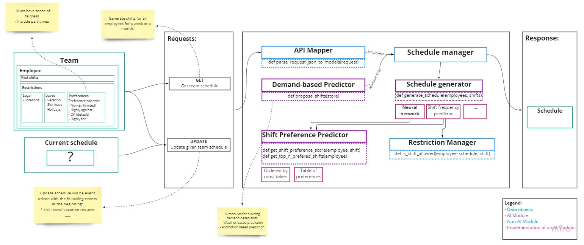

# Introduction
Team Schedule is a cloud-based app supporting managers and employees to effectively plan complex time shift scenarios. Available at the SAP store [here](https://store.sap.com/dcp/en/product/display-0000059791_live_v1/Team%20Schedule).

As part of the application we are including "*smart features*" that automate the process of creating shift such:
- generating shifts for all employees of a manager *(currently in developement)*
- predicting how many people and shifts are needed based on the demand for a given team/store *(future developement)*

The scope of this project is concerned only with "*smart features*".

# Project Architecture

## Overall arhitecture

## Modules

### 1 Data

### 2 Requests
We have two types of request - **GET** and **UPDATE**.

**GET** - Get the team schedule by genereting shifts for all employees for a week or a month.

**UPDATE** - This request is a feaute, but it's purpose will be the following: To be able to offer а new schedule if an employee wants to move his shift

### 3 API Mapper
The responsibility of this module is to map the incoming request that are in JSON format to our data models.

### 4 Schedule Manager
As the main purpose of the app is to generate a schedule for the manager's employees, we want to implement different types of schedule generators. The schedule manager will determine which implementation of the schedule generator to use. At the moment only the shift frequency predictor from the image is implemented.

### 5 Schedule Generator
The schedule generates shifts for all employees for a period of time. 
The shift frequency predictor ##TODO: Chris can you add a little bit more detail of the work of the shift frequency generator

### 6 Shift Preference Predictor

### 7 Restriction Manager

# Setting up project

## Virtual environment
### Create virtual environment

    python -m venv venv

### Enter virtual environment

#### Windows (powershell): 

    . venv\Scripts\activate

#### Unix or MacOS : 

    source venv/bin/activate

## Installing packages

     pip install -r .\requirements.txt 

  Make sure you are inside venv first.
  
## Static code analysis

### Black

    python -m black --line-length=150 .

### Isort

    python -m isort --line-length=150 --profile black .

### Flake8
    
    flake8 --tee --format=gl-codeclimate --max-line-length=120 --ignore=E203,E501,W503 --exclude venv,dist .
    

## Running tests

### Pytest

    py -m pytest ./test

    

# Deployment 

## Deployment to Azure
1. Go to the root directory of the project
2. Activate the venv
3. Install requirements if not already installed
4. `az login`
5. `az webapp up -n time-schedule-poc --sku F1`
6. (optional) if you want to observe the logs, execute `az webapp log tail -n time-schedule-poc` in a separate console. Note: you must navigate to the root of the project before command execution